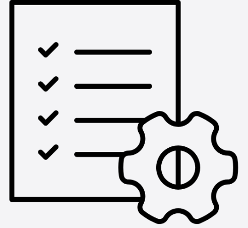

---js
const eleventyNavigation = {
	key: "Home",
	order: 1
};
---
# Home
Welcome to my personal website where you can find information about my projects, blog posts, publications, and more. I Carsten Felix Draschner, an AI Researcher with 8+ years of experience in AI, ML, DS. I am motivated by Science and AI for Social Good! I love to connect my passion for cutting-edge AI with my intrinsic motivation to bring myself into projects which make our life on earth more sustainable, our lives better, and our democracies more stable.

<nav class="card-navigation">
  <ul>
    <li>
      <a href="/blog/" style="text-decoration: none; color: inherit;">
        

          
          

            Blog
            
Recent AI innovations, ethical implications, and observations

          

        

      </a>
    </li>
    <li>
      <a href="/research/" style="text-decoration: none; color: inherit;">
        

          
          

            Research
            
Journal and Conference Publications and Thesis.

          

        

      </a>
    </li>
    <li>
      <a href="/projects/" style="text-decoration: none; color: inherit;">
        

          
          

            Projects
            
Sneak previews and Reports of my work experiences.

          

        

      </a>
    </li>
    <li>
      <a href="/about/" style="text-decoration: none; color: inherit;">
        

          
          

            About/CV
            
Overview of Educational Background and Job Experiences

          

        

      </a>
    </li>
    <li>
      <a href="/contact/" style="text-decoration: none; color: inherit;">
        

          
          

            Contact
            
Opportunities to reach out to me and sources for more content

          

        

      </a>
    </li>
  </ul>
</nav>
